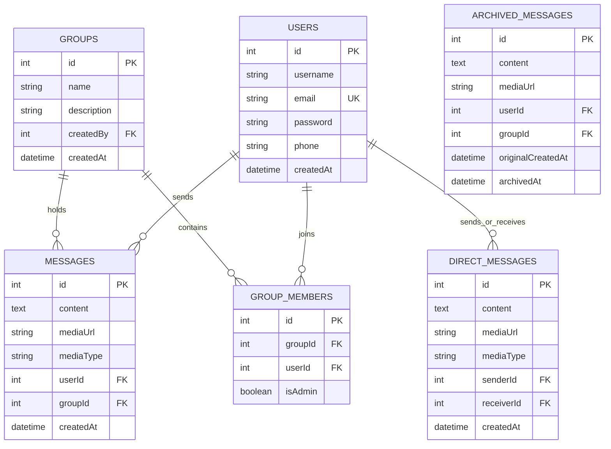

# PulseChat — Real-Time Group & Direct Messaging Platform

[](https://nodejs.org/)
[](https://expressjs.com/)
[](https://socket.io/)
[](https://www.mysql.com/)
[](https://aws.amazon.com/s3/)
[](https://ai.google.dev/)
[](https://www.docker.com/)
[](https://www.jenkins.io/)

A production-ready, full-stack real-time communication platform featuring multi-user group chat rooms, 1-on-1 private messaging, multimedia sharing via AWS S3 presigned URLs, intelligent AI assistance (smart replies, auto-completion, conversation summaries) powered by Google Gemini, automated message archiving, and a fully automated CI/CD pipeline on AWS EC2.

---

## Table of Contents

- [System Architecture](#system-architecture)
- [Key Features](#key-features)
- [Tech Stack](#tech-stack)
- [Database Schema & Archiving](#database-schema--archiving)
- [Project Directory Structure](#project-directory-structure)
- [Getting Started](#getting-started)
  - [Prerequisites](#prerequisites)
  - [Environment Configuration](#environment-configuration)
  - [Local Installation](#local-installation)
  - [Running with Docker Compose](#running-with-docker-compose)
- [API Documentation](#api-documentation)
- [WebSocket Events](#websocket-events)
- [Production Deployment & CI/CD](#production-deployment--cicd)
- [Security Features](#security-features)
- [License](#license)

---

## System Architecture

```
                                  +-----------------------+
                                  |   Web Browser Clients  |
                                  +-----------+-----------+
                                              |
                                              | HTTPS (443) / WSS
                                              v
                                  +-----------------------+
                                  |      Nginx Proxy      |
                                  |   (SSL Termination)   |
                                  +-----------+-----------+
                                              |
                                              | Proxy Pass (Port 5000)
                                              v
                                  +-----------------------+
                                  |     Express Server    | <---> [ Google Gemini API ]
                                  |    (PM2 Supervised)   |       (AI Summaries & Replies)
                                  +-----+-----------+-----+
                                        |           |
                     WebSocket / REST   |           | Presigned URLs / Uploads
                                        v           v
                          +-------------------+   +--------------------+
                          |   MySQL 8.0 DB    |   |     AWS S3 Bucket  |
                          | (Sequelize ORM)   |   | (Media Attachment) |
                          +-------------------+   +--------------------+
                                    ^
                                    | Nightly 02:00 Cron
                          +-------------------+
                          |  archiveJob.js    | (Moves >1 day msgs
                          | (Node Cron Task)  |  to Archived tables)
                          +-------------------+
```

---

## Key Features

- **Real-Time Group Collaboration**: Create public/private groups, manage members, assign administrator privileges, and broadcast messages instantly via WebSockets.
- **Direct 1-on-1 Messaging**: Encrypted private channels between users with real-time delivery status, unread badges, and active chat notifications.
- **AI-Powered Assistance (Google Gemini)**:
  - **Smart Reply Recommendations**: Context-aware 1-click response chips based on recent conversation flow.
  - **Draft Auto-Completion**: Predictive sentence completions while composing messages.
  - **Catch-up Discussion Summaries**: Condensed bullet-point synopses of unread group conversations.
- **Secure Multimedia Sharing**:
  - Direct file/image uploads backed by **AWS S3**.
  - Secure signed URLs with temporary expiration for private asset retrieval.
- **Automated Data Lifecycle & Archiving**:
  - Scheduled `node-cron` job running every night at 02:00 AM.
  - Automatically moves messages older than 24 hours from `Messages` and `DirectMessages` to dedicated `ArchivedMessages` and `ArchivedDirectMessages` tables to keep active transaction tables fast and lean.
- **Resilient Client Architecture**:
  - Bundled local Socket.IO client library eliminating external CDN points of failure.
  - Defensive fallback socket implementation ensuring the app functions via REST API even in network environments blocking WebSockets.
- **Enterprise CI/CD & Deployment**:
  - Declarative Jenkins 5-stage pipeline triggered automatically via GitHub Webhooks.
  - Zero-downtime hot reloads using PM2 cluster mode.
  - Automated post-deployment HTTP health checks.

---

## Tech Stack

| Layer | Technologies |
|---|---|
| **Frontend** | Vanilla ES6+ JavaScript Modules, Responsive CSS3 with custom variables, Local Socket.IO Client |
| **Backend** | Node.js (v18+), Express.js (v5), Socket.IO (v4) |
| **Database & ORM** | MySQL 8.0, Sequelize ORM (Connection pooling, Transactions) |
| **Cloud Storage** | AWS S3 SDK v3 (`@aws-sdk/client-s3`, `@aws-sdk/s3-request-presigner`) |
| **Artificial Intelligence**| Google Gemini API (`@google/genai`) |
| **Security & Auth** | JSON Web Tokens (`jsonwebtoken`), `bcryptjs`, `helmet`, `cors`, `express-rate-limit` |
| **DevOps & Hosting** | AWS EC2 (Ubuntu 24.04 LTS), Nginx Reverse Proxy, Let's Encrypt SSL, PM2, Docker, Jenkins |

---

## Database Schema & Archiving



---

## Project Directory Structure

```plaintext
group-chat-app/
├── client/                     # Frontend Client
│   ├── css/                    # Stylesheets & themes
│   │   └── style.css           # Modern CSS3 layout & responsive styles
│   ├── js/                     # Client-side ES modules
│   │   ├── ai.js               # Gemini AI UI interactions & smart replies
│   │   ├── api.js              # Centralized REST API client & helpers
│   │   ├── chat.js             # Core chat controller & DOM binding
│   │   ├── socket.js           # Socket.IO connection manager & fallback
│   │   ├── socket.io.min.js    # Self-hosted Socket.IO client library
│   │   ├── state.js            # Reactive application state store
│   │   └── utils.js            # Date formatting, DOM sanitizers, helpers
│   ├── chat.html               # Main chat dashboard
│   ├── login.html              # Authentication login interface
│   └── signup.html             # User registration interface
│
├── server/                     # Backend API & WebSocket Engine
│   ├── config/                 # Database & environment configurations
│   │   └── database.js         # Sequelize MySQL connection pool
│   ├── controllers/            # Request handlers
│   │   ├── authController.js
│   │   ├── groupController.js
│   │   ├── messageController.js
│   │   ├── personalMessageController.js
│   │   ├── mediaController.js
│   │   └── aiController.js
│   ├── jobs/                   # Background scheduled tasks
│   │   └── archiveJob.js       # Nightly message archiving cron job
│   ├── middleware/             # Express middlewares
│   │   ├── authMiddleware.js   # JWT verification & route protection
│   │   └── upload.js           # Multer memory storage configuration
│   ├── models/                 # Sequelize Data Models
│   │   ├── User.js
│   │   ├── Group.js
│   │   ├── GroupMember.js
│   │   ├── Message.js
│   │   ├── DirectMessage.js
│   │   ├── ArchivedMessage.js
│   │   ├── ArchivedDirectMessage.js
│   │   └── associations.js     # Foreign key relations & cascades
│   ├── routes/                 # Express API Route declarations
│   ├── services/               # Business logic & 3rd-party integrations
│   │   ├── aiService.js        # Google Gemini prompt engineering
│   │   ├── archiveService.js   # Batch database archiving service
│   │   ├── authService.js      # Password hashing & JWT issuance
│   │   ├── s3Service.js        # AWS S3 presigned upload & retrieval
│   │   └── ...
│   ├── socket-io/              # WebSocket handlers & middleware
│   │   ├── handlers/
│   │   │   ├── chat.js         # Group chat room events
│   │   │   └── personalChat.js # 1-on-1 private messaging events
│   │   ├── middleware.js       # Socket JWT authentication handshake
│   │   └── index.js            # Socket.IO instance initialization
│   ├── app.js                  # Express app setup & route registration
│   └── server.js               # HTTP/WebSocket entry point & DB sync
│
├── deploy/                     # Infrastructure as Code
│   ├── nginx.conf              # Production Nginx reverse proxy configuration
│   └── setup-ec2.sh            # Automated EC2 bootstrap script
│
├── Dockerfile                  # Production container definition
├── docker-compose.yml          # Multi-container orchestration (App + MySQL)
├── docker-compose.env.example  # Template environment file for Docker
├── ecosystem.config.js         # PM2 process management & cluster config
├── Jenkinsfile                 # Declarative CI/CD pipeline definition
└── package.json                # Project root script runner
```

---

## Getting Started

### Prerequisites

- **Node.js**: v18.0.0 or higher
- **MySQL**: 8.0 or higher
- **npm** or **yarn**
- *(Optional)* AWS Account with an S3 Bucket
- *(Optional)* Google AI Studio API Key for Gemini features

---

### Environment Configuration

Create a `.env` file inside the `server/` directory (or copy from `docker-compose.env.example` at root):

```ini
# Server Configuration
PORT=5000
NODE_ENV=development
CLIENT_ORIGIN=http://localhost:5000

# Security
JWT_SECRET=your_super_secret_jwt_key_at_least_64_characters_long

# MySQL Database
DB_HOST=127.0.0.1
DB_PORT=3306
DB_NAME=group_chat_db
DB_USER=chatuser
DB_PASSWORD=your_secure_password

# AWS S3 (Optional: for cloud file/media uploads)
AWS_REGION=us-east-1
AWS_BUCKET_NAME=your-s3-bucket-name
AWS_ACCESS_KEY_ID=your_aws_access_key
AWS_SECRET_ACCESS_KEY=your_aws_secret_key

# Google Gemini AI (Optional: for AI suggestions & summaries)
GEMINI_API_KEY=your_gemini_api_key
```

---

### Local Installation

1. **Clone the repository**:
   ```bash
   git clone https://github.com/shivam2399/group-chat-app.git
   cd group-chat-app
   ```

2. **Install dependencies**:
   ```bash
   # Install root scripts & dependencies
   npm install

   # Install backend server dependencies
   cd server
   npm install
   cd ..
   ```

3. **Set up MySQL Database**:
   ```sql
   CREATE DATABASE group_chat_db CHARACTER SET utf8mb4 COLLATE utf8mb4_unicode_ci;
   CREATE USER 'chatuser'@'localhost' IDENTIFIED BY 'your_secure_password';
   GRANT ALL PRIVILEGES ON group_chat_db.* TO 'chatuser'@'localhost';
   FLUSH PRIVILEGES;
   ```

4. **Start the application**:
   ```bash
   # Run in development mode with auto-reload (nodemon)
   npm run dev

   # Or run in standard mode
   npm start
   ```

5. **Open in browser**:
   Navigate to [http://localhost:5000](http://localhost:5000) (redirects to `/login.html`).

---

### Running with Docker Compose

To launch the complete application along with a dedicated MySQL 8 container in one command:

```bash
# 1. Copy the example environment file
cp docker-compose.env.example .env

# 2. Build and start containers in detached mode
docker compose up -d --build

# 3. View live application logs
docker compose logs -f app
```

To stop containers:
```bash
docker compose down
```

---

## API Documentation

### Authentication (`/api/auth`)
- `POST /api/auth/signup` — Register a new account (`username`, `email`, `password`, `phone`).
- `POST /api/auth/login` — Authenticate and receive a signed JWT token.

### Users (`/api/users`)
- `GET /api/users` — List registered users for 1-on-1 direct messaging (Protected).
- `GET /api/users/profile` — Fetch current authenticated user's profile (Protected).

### Groups (`/api/groups`)
- `POST /api/groups` — Create a new group.
- `GET /api/groups` — List groups the user is a member of.
- `GET /api/groups/:groupId/members` — List members of a group.
- `POST /api/groups/:groupId/members` — Add member to group (Admin only).
- `DELETE /api/groups/:groupId/members/:userId` — Remove member from group (Admin only).
- `POST /api/groups/:groupId/make-admin` — Grant administrator privileges to a member.

### Messages (`/api/messages` & `/api/personal-messages`)
- `GET /api/messages/:groupId?lastMessageId=N` — Fetch paginated group message history.
- `POST /api/messages/:groupId` — Post a message to a group.
- `GET /api/personal-messages/:userId?lastMessageId=N` — Fetch 1-on-1 message history.
- `POST /api/personal-messages/:userId` — Send a direct 1-on-1 message.

### Media & Attachments (`/api/media`)
- `POST /api/media/presigned-url` — Generate an authenticated S3 presigned PUT URL for direct browser uploads.
- `POST /api/media/upload` — Direct server-side multipart/form-data upload.

### AI Assistance (`/api/ai`)
- `POST /api/ai/suggest` — Generate contextual reply suggestions based on recent conversation history.
- `POST /api/ai/autocomplete` — Get autocomplete predictions for text currently being drafted.
- `POST /api/ai/summarize` — Generate an executive bullet-point summary of unread messages in a group.

### Health Check
- `GET /api/health` — Returns application uptime and status code 200 for load balancers and deployment monitoring.

---

## WebSocket Events

All WebSocket connections require JWT authentication via handshake credentials:
```javascript
const socket = io("https://us-chat.duckdns.org", {
  auth: { token: "<JWT_TOKEN>" }
});
```

| Direction | Event Name | Payload / Description |
|---|---|---|
| **Client → Server** | `join_group` | `{ groupId }` — Joins the Socket room for a group |
| **Client → Server** | `leave_group` | `{ groupId }` — Leaves the group room |
| **Client → Server** | `send_message` | `{ groupId, content, mediaUrl, mediaType }` — Broadcasts group message |
| **Server → Client** | `receive_message` | New group message payload received in room |
| **Client → Server** | `send_personal_message`| `{ receiverId, content, mediaUrl, mediaType }` — Sends direct message |
| **Server → Client** | `receive_personal_message`| Real-time direct message delivered to recipient |
| **Client → Server** | `typing` | `{ groupId, isTyping }` — Broadcasts typing indicators |
| **Server → Client** | `user_typing` | `{ userId, username, isTyping }` |

---

## Production Deployment & CI/CD

### Architecture Overview
The application is deployed on an **AWS EC2** instance (`t2.micro`, Ubuntu 24.04 LTS) configured with:
- **Nginx**: Serving as a reverse proxy, handling SSL termination via Let's Encrypt / Certbot, static asset caching, and WebSocket connection upgrading (`Upgrade`, `Connection "upgrade"`).
- **PM2**: Supervising Node.js processes in cluster mode with memory management (`max_memory_restart: '250M'`) and automated system reboot persistence (`pm2 startup`).
- **Jenkins CI/CD**:
  - Automatically triggered upon code push to `main` via GitHub Webhook.
  - Pulls latest changes, installs clean production dependencies (`npm ci --omit=dev`), runs syntax & configuration linting, performs a zero-downtime hot reload via `pm2 reload`, and verifies deployment with an automated HTTP health probe against `/api/health`.

### PM2 Commands
```bash
npm run pm2:start    # Start application with ecosystem.config.js
npm run pm2:reload   # Zero-downtime hot reload with updated environment
npm run pm2:logs     # Stream live production logs
npm run pm2:stop     # Stop application
```

---

## Security Features

- **Password Hashing**: Bcrypt with 10 salt rounds prevents rainbow table and brute-force attacks.
- **JWT Authorization**: Stateless tokens with cryptographically secure signatures on all sensitive routes.
- **Rate Limiting**: Brute-force protection on authentication and AI routes via `express-rate-limit`.
- **SQL Injection Defense**: Sequelize ORM query parameterization throughout all data access layers.
- **XSS Mitigation**: Client-side text node rendering and HTML sanitizers preventing malicious script execution in chat messages.
- **Presigned S3 URLs**: Media uploads never expose permanent cloud storage credentials to the public client.
- **HTTPS & SSL/TLS**: End-to-end encrypted transport via Let's Encrypt certificates.

---

## License

Distributed under the ISC License. See `LICENSE` for more information.

